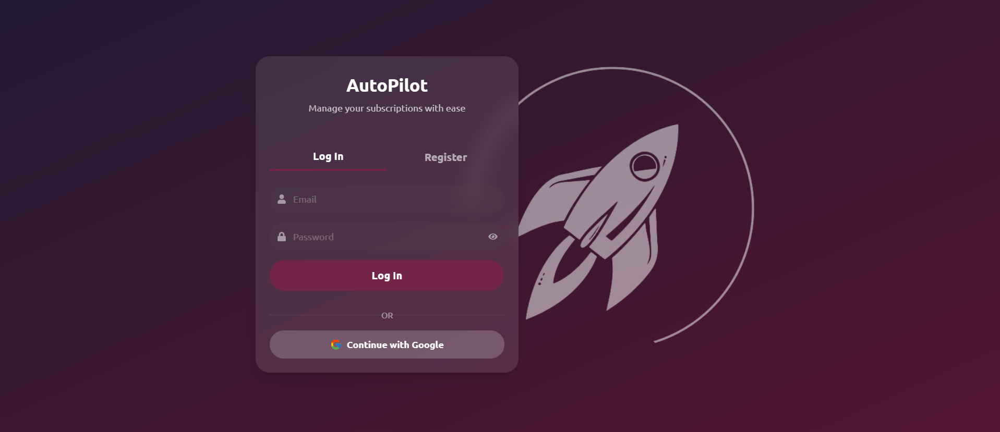
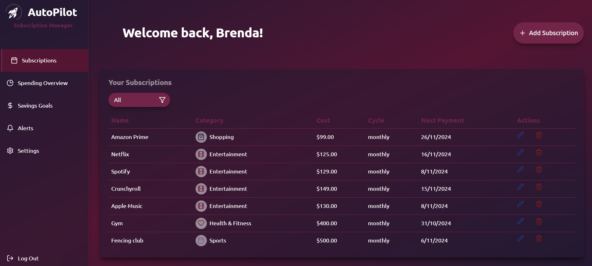
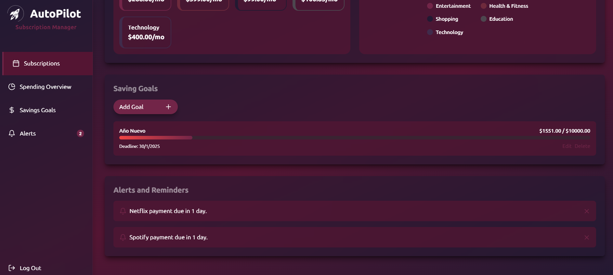
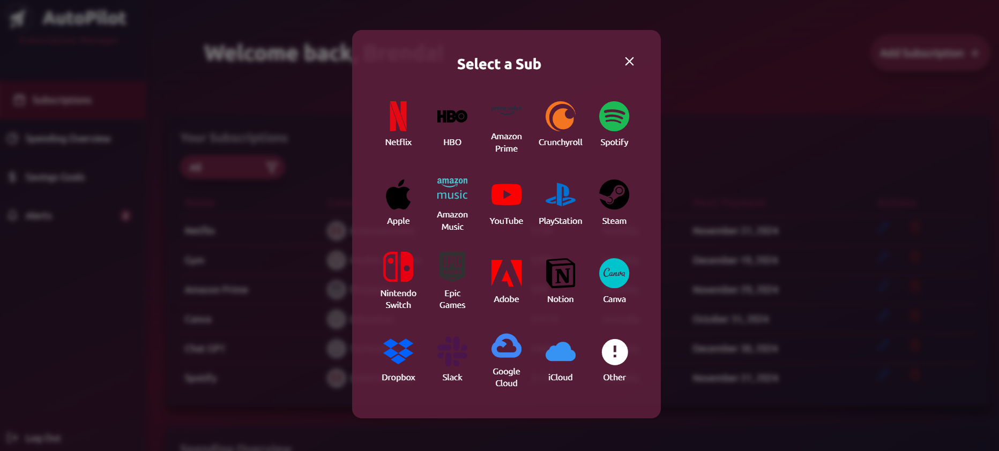
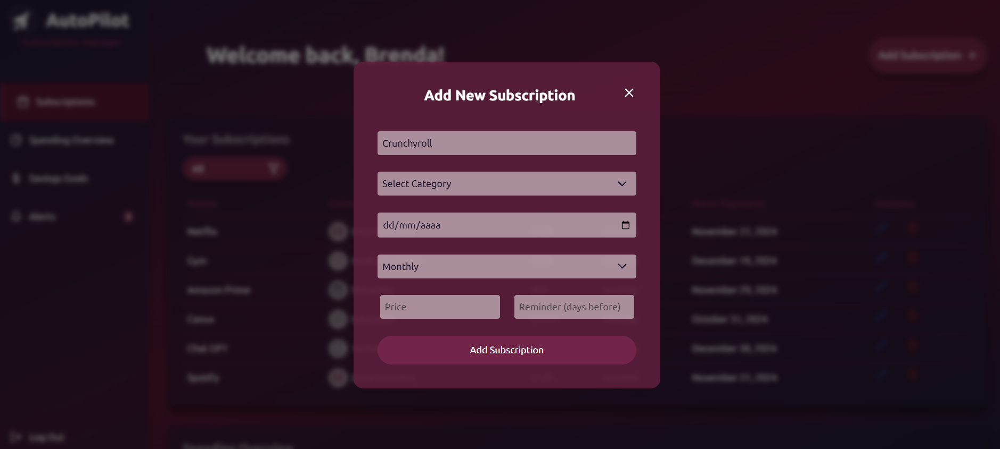
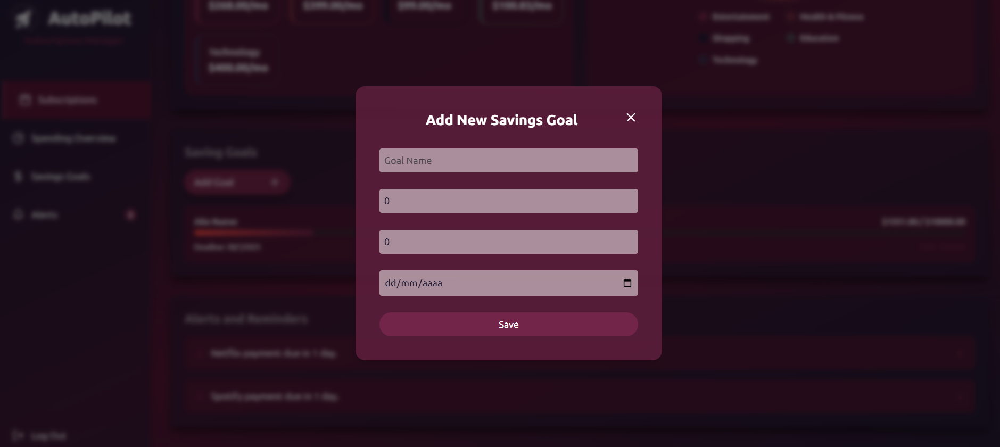

# AutoPilot 🚀 - Gestor de Suscripciones

AutoPilot es una aplicación web diseñada para ayudar a los usuarios a gestionar sus suscripciones mensuales. La aplicación permite registrar suscripciones, visualizar el costo total mensual, recibir recordatorios de renovación y establecer metas de ahorro. Con gráficos interactivos y categorías personalizables, AutoPilot ofrece una visión clara de cómo afectan las suscripciones al presupuesto.

## Características

- **Registro de Suscripciones**: Agrega todas tus suscripciones mensuales (Netflix, Spotify, gimnasio, etc.) con sus respectivos costos y fechas de renovación.
- **Categorías y Filtros**: Clasifica tus suscripciones en categorías como entretenimiento, salud, educación, entre otros, y utiliza filtros para ver solo ciertos tipos de suscripciones.
- **Resumen de Gastos**: Visualiza el costo total mensual de tus suscripciones y proyecta el gasto anual.
- **Recordatorios y Alertas**: Configura alertas para recibir notificaciones cuando se acerque la fecha de renovación o pago de una suscripción, a través de email o notificaciones del navegador.
- **Metas de Ahorro**: Establece objetivos de ahorro relacionados con tus suscripciones, lo que facilita un mejor manejo de tu presupuesto.
- **Visualización de Gastos**: Usa gráficos de barras o circulares para obtener una vista clara del gasto anual proyectado en suscripciones.

## Tecnologías Utilizadas

- **Frontend**: [Vite](https://vitejs.dev/), [React](https://reactjs.org/), [Tailwind CSS](https://tailwindcss.com/)
- **Backend**: [Node.js](https://nodejs.org/)
- **Base de Datos y Autenticación**: [Firebase](https://firebase.google.com/)

## Interfaz de Usuario

### Login y Registro

La primera pantalla que ve el usuario al ingresar a la aplicacion es donde puede Registrarse o Iniciar Sesión


### Mis Subscripciones

Al registrarse e inicar sesion en la aplicació, se le direccionará a la seccion Dashboard en donde se enlistarán todas las suscripciones actuales en el perfil del usuario


### Detalles de Gastos

Un poco más abajo en el Dashboard encontrará los detalles y descripcion general del gasto (Spending Overview) basado en los datos de sus suscripciones.


### Metas de Ahorro y Alertas

Al final del dashboard se encuentran las metas de ahorro donde el usuario puede ver cuanto dinero a ahorrado cancelando ciertas suscripciones y abajo se ecuentran las Alertas y recordatorios donde se elistan todos los días proximos para realizar los pagos de las suscripciones


### Modal para agregar Suscripcion

Un modal de dos fases que sirve para añadir nuevas suscipciones al perfil del usuario



### Modal para agregar Meta de Ahorro

Un pequeño modal para añadir nuevas metas de ahorro y editarlas


## Instalación y Ejecución

1. Clonar el Repositorio

```
git clone https://github.com/brenda-0021/AutoPilot-suscripciones.git
```

2. Acceder al directorio del proyecto

```
cd AutoPilot-suscripciones
```

3. Instalar las dependencias

```
npm install
```

4. Para iniciar un servidor en desarrollo y trabajar en el proyecto ejecuta

```
npm run dev
```

El servidor de desarrollo estará disponible en http://localhost:5173 (o en el puerto que indique la terminal).

## Producción

La aplicación está desplegada y disponible en Netlify. Puedes acceder a ella en el siguiente enlace:
🌐 [AutoPilot Suscripciones en Netlify](https://6745758e5958cfe1e95a356a--autopilotsubs.netlify.app/)

## Autor

Desarrollado por **Brenda Zamarripa Ramirez**
